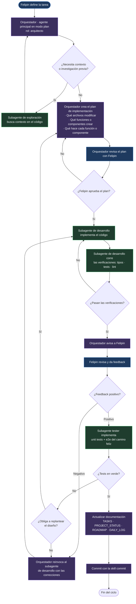

# Workflow

El agente principal, en modo plan, cumple el rol de orquestador y arquitecto.
El orquestador llama a los subagentes pertinentes para cumplir su tarea.
Recibe feedback de subagentes y de Felipin para continuar en el loop; Felipin es quien pilotea la IA.
Dependiendo del feedback es a quién llama.

## Roles

- **Felipin** — pilotea. Define la tarea, aprueba el plan, revisa el resultado y da feedback.
- **Orquestador** (agente principal, en modo plan) — arquitecto. Crea el plan e invoca subagentes. No implementa código.
- **Subagente de exploración** — busca contexto en el código cuando el orquestador no lo tiene. Opcional.
- **Subagente de desarrollo** — implementa el código y corre las verificaciones.
- **Subagente tester** — implementa unit tests y tests e2e.

## Ciclo

1. Felipin define la tarea.
2. El orquestador reúne el contexto que le falte, invocando subagentes de exploración si hace falta.
3. El orquestador crea el plan de implementación:
   - Qué archivos debe modificar.
   - Qué funciones o componentes se deben crear.
   - Qué hace cada función o componente.
4. El orquestador revisa el plan con Felipin. Si no lo aprueba, vuelve al paso 3.
5. Aprobado el plan, el orquestador se lo pasa al subagente de desarrollo.
6. El subagente de desarrollo implementa el código y corre las verificaciones antes de entregar.
7. El orquestador le avisa a Felipin, solo una vez que las verificaciones pasan.
8. Felipin revisa y da feedback.
   - **Negativo**: el orquestador reinvoca al subagente de desarrollo con las correcciones y se vuelve al paso 6.
   - **Positivo**: sigue al paso 9.
9. El orquestador invoca al subagente tester, que implementa los tests.
10. Si los tests fallan, el tester le reporta al orquestador y este reinvoca al subagente de desarrollo. El ciclo se repite hasta tenerlos en verde. Solo se interrumpe a Felipin si el fallo obliga a replantear el diseño, en cuyo caso se vuelve al paso 3.
11. Con los tests en verde, se actualiza la documentación y se hace el commit.

## Verificaciones

Las corre el **subagente de desarrollo antes de entregar**, no el orquestador después. Según lo que toque el cambio:

```bash
npm exec -w apps/api -- tsc --noEmit
npm test -w apps/api
npm exec -w apps/mobile -- tsc --noEmit
npm run lint -w apps/mobile
```

El orquestador no le avisa a Felipin hasta que pasen. Así la revisión de Felipin se gasta en decisiones de producto y no en errores de compilación.

## Tests

- **Unit tests**: los casos que correspondan al cambio.
- **Tests e2e**: solo el camino feliz.

## Cierre

Al terminar, actualizar la documentación según la sección `## Documentación` de `CLAUDE.md` (esa es la única fuente de esas reglas, no se repiten aquí) y cerrar el commit con la skill `commit`.

## Diagrama


